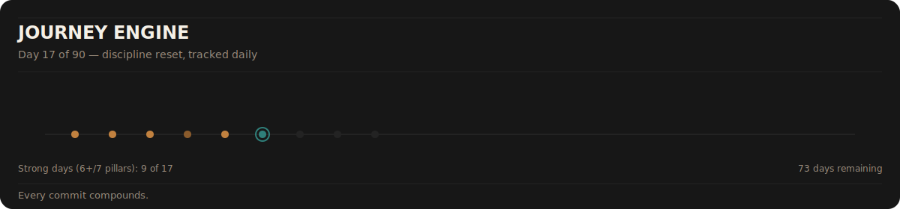
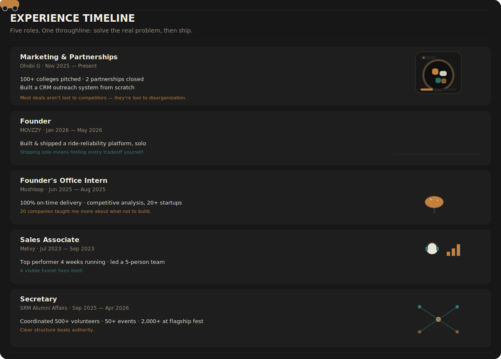
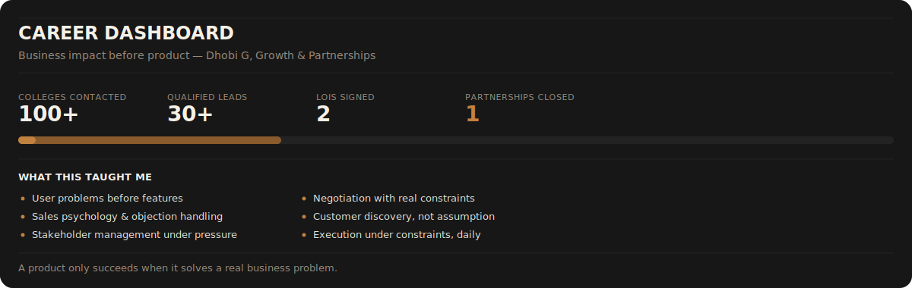
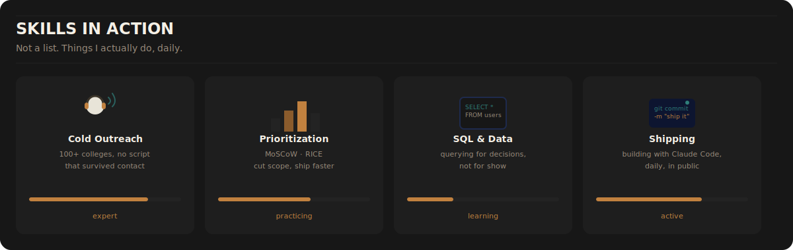
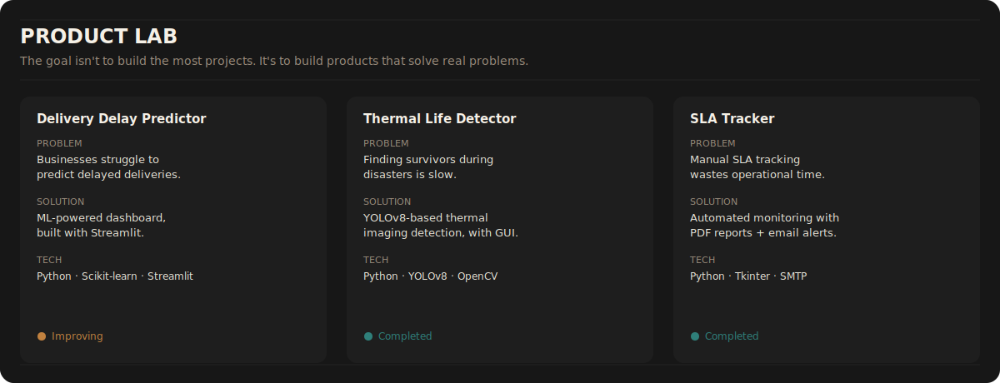
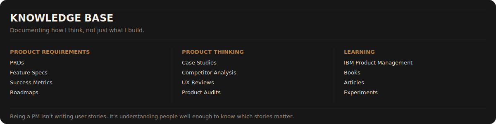

  

> **I don't want to become a Product Manager by waiting for an opportunity.**
>
> **I'm building my way there.**
>
> Every project, experiment, business problem and lesson on this profile is part of that journey.

---

## What This Profile Is

This isn't a collection of repositories. It's a public, dated record of a career transition.

I'm currently in Marketing & Partnerships at Dhobi G, transitioning deliberately into Product Management — not by waiting for the title, but by doing the actual work of a PM today: researching problems, prioritizing ruthlessly, writing specs, shipping things, and documenting every step in public.

Every section below is real. Every number is accurate. Nothing here is aspirational copy — it's a running log.

---

---

---

---

---

---

---

## My Product Principles

**01 — Solve Problems, Not Features**
Users don't care about features. They care about outcomes.

**02 — Validate Before Building**
The best feature is often the one you never build.

**03 — Execution Beats Ideas**
Ideas are everywhere. Execution creates products.

**04 — Learn in Public**
Every project teaches something. Every mistake is documented. Every improvement compounds.

**05 — Consistency Wins**
Small progress every day beats occasional bursts of motivation.

---

## Tech Stack

**Product** — Product Thinking · User Research · Roadmapping · Competitive Analysis · Wireframing · Market Research

**Programming** — Python · Java · C++ · SQL · Git

**AI & Data** — Machine Learning · Pandas · NumPy · Streamlit

**Currently Learning** — Product Management (IBM cert, in progress) · SQL (SQLBolt + HackerRank) · Figma · System Design

**Tools** — Claude Code · GitHub · Notion · Jira (learning)

---

## GitHub Activity

  

---

## Current Roadmap

Build in public · Complete IBM Product Management · Publish product case studies · Build AI Planning Platform · Create PM portfolio · Transition into Product Management

---

  

**Building today for opportunities I'll earn tomorrow.**

<i>Always open to conversations about Product, AI, Startups and Building.</i>

